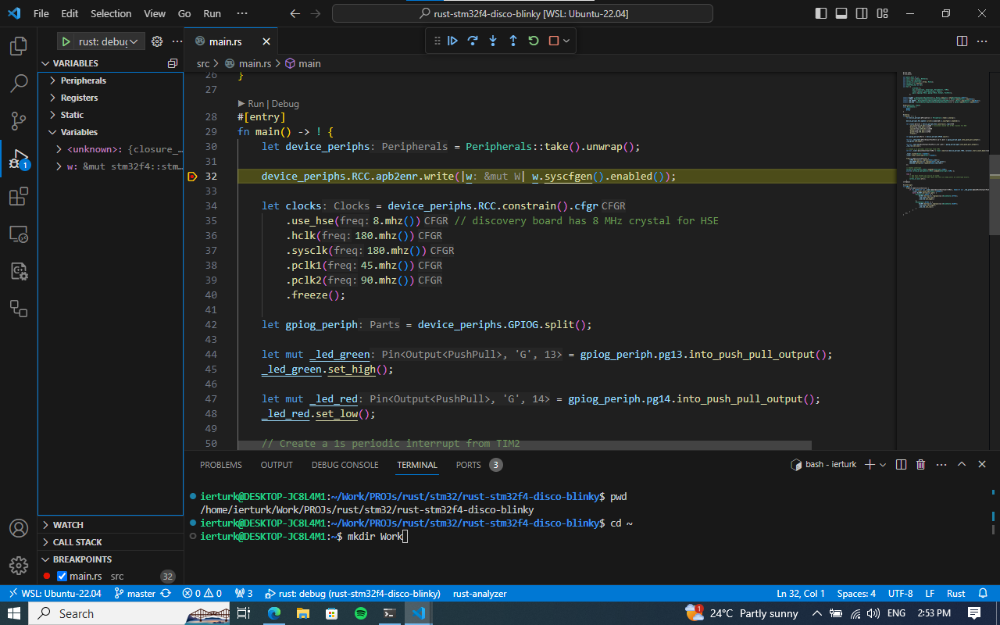
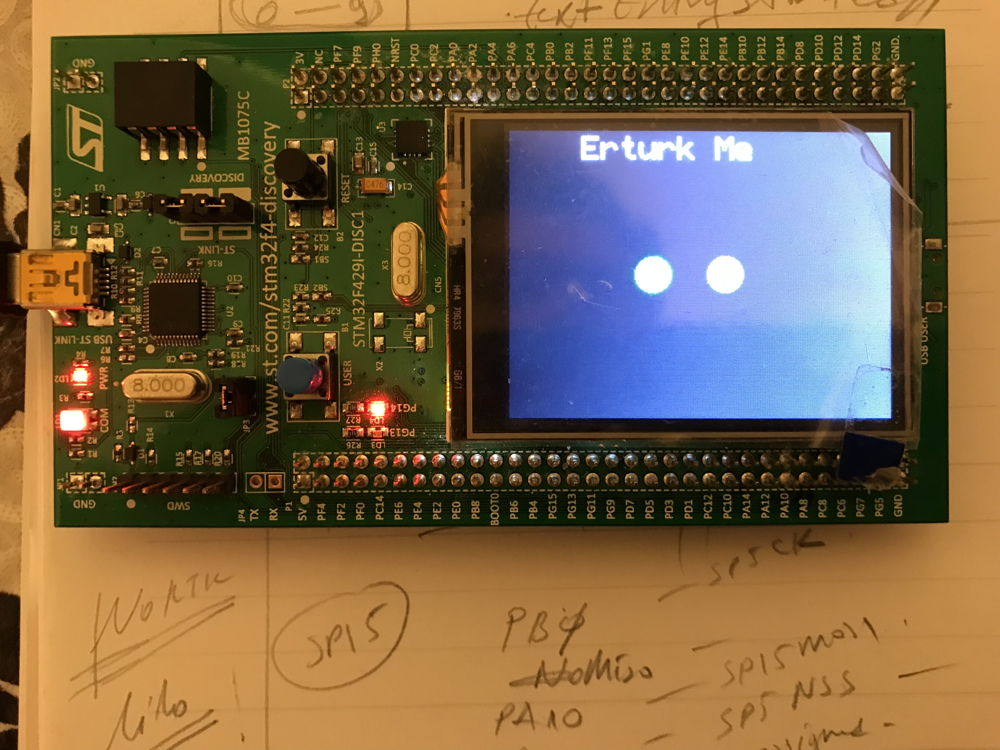

# An Application in Rust Lilos Async RTOS on the STM32F429-Discovery board with probe-rs on VSCode

[Associated post](https://erturk.me/projects/working-with-rust-embedded-on-wsl/)

Small project by using Ebassy Async RTOS

If everything is installed properly, the workspace can be opened in VS Code and a hit on F5 should build the project without errors or warnings and automatically start a debug session. The program should be halted at the breakpoint at main().

In this post, it’ll be tried to explain how to get a working example by using only the tools that provided by Rust community. So let’s start!
___
### The Tools that Used within this Post
- Rust Toolchain[^1]
- usbpid-win[^2]
- probe-rs[^3]
- VSCode[^4]
- WSL[^5]
- rust-analyzer plugin for VSCode[^6]
- probe-rs plugin for VSCode[^7]
- WSL plugin for VSCode[^8]
- GitHUB repository[^9]
- STM32F429ZI Discovery Board[^10]
- Embassy OS[^11]

___
### Setup
- Install WSL[^12] and an Ubuntu 22.04.2 LTS[^13] instance from Windows Store
- Download and install usbpid-win from the Github repository[^2]
- Run the WSL instance on a windows commandline as follow
```
PS C:\Users\ierturk> wsl ~
```
- Install probe-rs within WSL instance as decribed in here[^3]
- Plugin the Discovery board into a USB port on your Windows PC   
On a windows command line when you issued follwing commad,  a list will be displayed
```
PS C:\Users\ierturk> usbipd wsl list
BUSID  VID:PID    DEVICE                                                        STATE
3-1    0483:374b  ST-Link Debug, USB Mass Storage Device, STMicroelectronic...  Not attached
3-2    046d:c52b  Logitech USB Input Device, USB Input Device                   Not attached
4-1    05ac:8509  FaceTime HD Camera (Built-in), FaceTime HD camera             Not attached
6-2    05ac:8242  Apple IR Receiver                                             Not attached
6-3    05ac:0253  Apple Keyboard, Apple Multi-Touch, USB Input Device           Not attached
7-3    05ac:821d  Apple Broadcom Built-in Bluetooth                             Not attached
```
- Bind the USB device on an elevated command line as follow   
```
PS C:\Users\root> usbipd bind --busid 3-1
```
- Now you can attach the USB device as standard user as follow   
```
PS C:\Users\ierturk> usbipd wsl attach --busid 3-1
```
- Install VSCode and the plugins mentioned here [^6] [^7] [^8]

___
### Running and Debugging
- Open VSCode
- Install WSL plugin[^8] in VSCode
- Connect to WSL instance from within VSCode using WSL plugin[^8]
- Install rust-analyzer[^6] and probe-rs[^7] plugins in VSCode in WSL instance
- Open terminal in VSCode
- Create a work directory and clone the repository[^9] as follow
```
ierturk@DESKTOP-JC8L4M1:~$ mkdir Work
ierturk@DESKTOP-JC8L4M1:~$ cd Work
ierturk@DESKTOP-JC8L4M1:~$ sudo apt-get install git
ierturk@DESKTOP-JC8L4M1:~$ git clone https://github.com/ierturk/rust-embedded-wsl-probe-rs.git
```
- Open folder `rust-embedded-wsl-probe-rs`
- Now just open debug tab and hit the button
- Place breakpoints where you want
- Hit the play button

Then it should be displayed following screen

___
### Conclusion

It just woks as you can see. Yo can work on this and modify some parts according to your requirements.

Hope you enjoyed with the tutorial, found useful.
Thank you for reading.

[^1]: [Rust Getting Started](https://www.rust-lang.org/learn/get-started)

[^2]: [usbpid-win](https://github.com/dorssel/usbipd-win)

[^3]: [probe-rs](https://probe.rs/docs/getting-started/installation/)

[^4]: [VSCode](https://code.visualstudio.com/)

[^5]: [WSL](https://learn.microsoft.com/en-us/windows/wsl/install)

[^6]: [rust-analyzer plugin for VSCode](https://marketplace.visualstudio.com/items?itemName=rust-lang.rust-analyzer)

[^7]: [probe-rs plugin for VSCode](https://marketplace.visualstudio.com/items?itemName=probe-rs.probe-rs-debugger)

[^8]: [WSL plugin for VSCode](https://marketplace.visualstudio.com/items?itemName=ms-vscode-remote.remote-wsl)

[^9]: [GitHUB repository](https://github.com/ierturk/rust-stm32f4-embassy)

[^10]: [STM32F429ZI Discovery Board](https://www.st.com/en/evaluation-tools/32f429idiscovery.html)

[^11]: [Embassy OS](https://embassy.dev/)

[^12]: [WSL - Windows Subsystem for Linux](https://apps.microsoft.com/detail/windows-subsystem-for-linux/9P9TQF7MRM4R?hl=en-gb&gl=US)

[^13]: [Ubuntu 22.04.2 LTS](https://apps.microsoft.com/detail/9PN20MSR04DW?hl=en-gb&gl=US)

