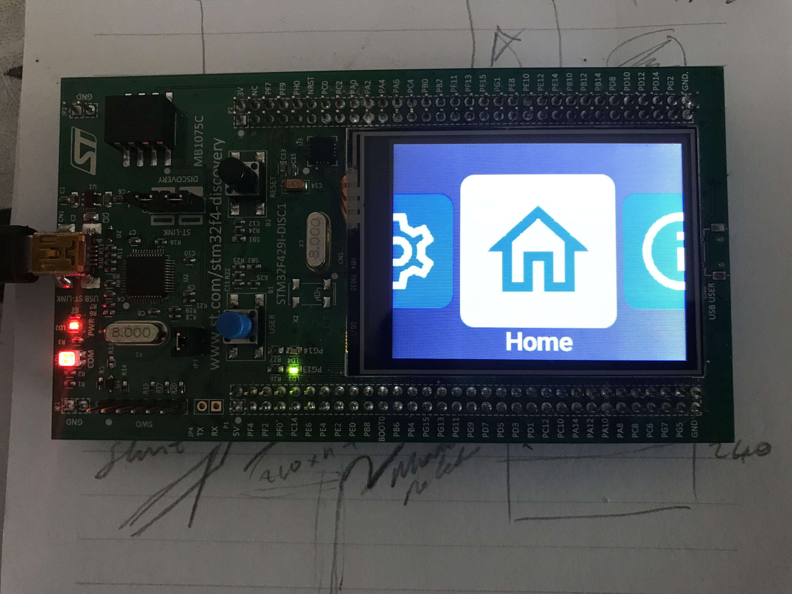

# A Rust Board Support Package (BSP) and Example Slint Application for STM32F429-Discovery Kit 
[Associated post](https://erturk.me/projects/a-rust-bsp-package-for-stm32f4-discovery-kit/)

   
#made-with-slint
___
### The Tools that Used within this Post
- [Rust Toolchain](https://www.rust-lang.org/learn/get-started)
- [usbpid-win](https://github.com/dorssel/usbipd-win)
- [probe-rs](https://probe.rs/docs/getting-started/installation/)
- [VSCode](https://code.visualstudio.com/)
- [WSL](https://learn.microsoft.com/en-us/windows/wsl/install)
- [rust-analyzer plugin for VSCode](https://marketplace.visualstudio.com/items?itemName=rust-lang.rust-analyzer)
- [probe-rs plugin for VSCode](https://marketplace.visualstudio.com/items?itemName=probe-rs.probe-rs-debugger)
- [WSL plugin for VSCode](https://marketplace.visualstudio.com/items?itemName=ms-vscode-remote.remote-wsl)
- [GitHUB repository](https://github.com/ierturk/rust-on-stm32)
- [STM32F429ZI Discovery Board](https://www.st.com/en/evaluation-tools/32f429idiscovery.html)
- [WSL - Windows Subsystem for Linux](https://apps.microsoft.com/detail/windows-subsystem-for-linux/9P9TQF7MRM4R?hl=en-gb&gl=US)
[Ubuntu 22.04.2 LTS](https://apps.microsoft.com/detail/9PN20MSR04DW?hl=en-gb&gl=US)
- [Slint](https://slint.dev/)
- [Slint Plugin for VSCode](https://marketplace.visualstudio.com/items?itemName=Slint.slint)
- [lilos Async RTOS](https://github.com/cbiffle/lilos)
___
### Setup
For setup the whole development system on WSL and VSCode please refer to [this post](https://erturk.me/projects/working-with-rust-embedded-on-wsl/)
___
### Running and Debugging
- Clone [the repository](https://github.com/ierturk/rust-on-stm32)
- Open the folder in VSCode
- In terminal
```
ierturk@DESKTOP-JC8L4M1:~$ cargo run -release
```
Or
- It can be run through VSCode menus 
___
### Conclusion
This is the Slint Carousel Demo running on the F4 MCU   



Happy reading and coding!

